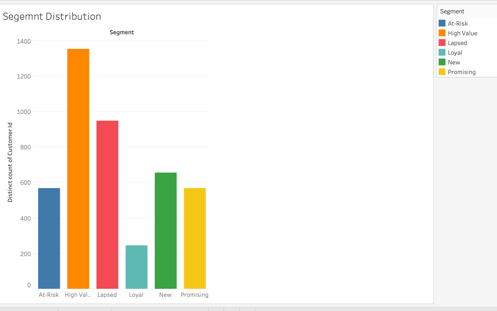
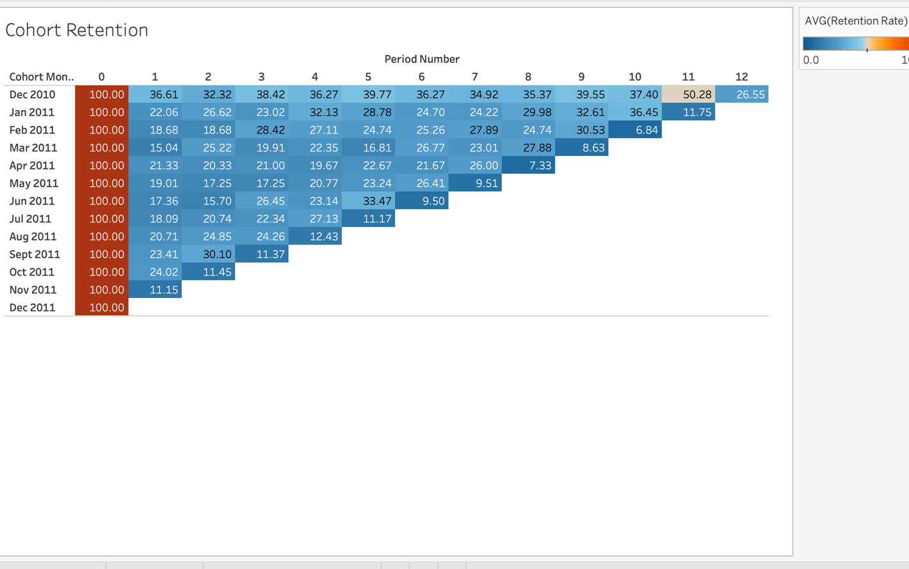
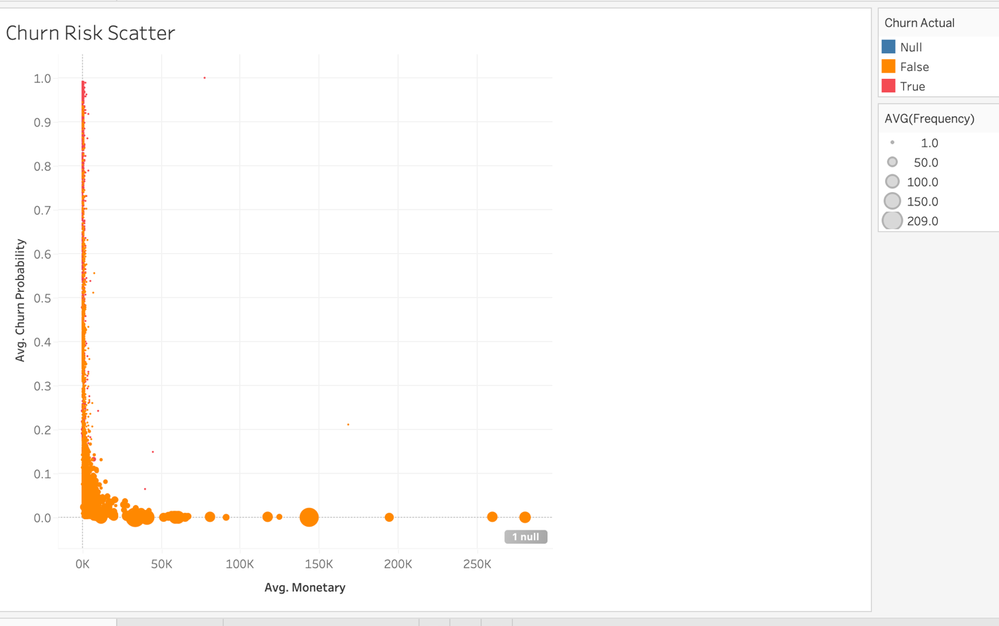
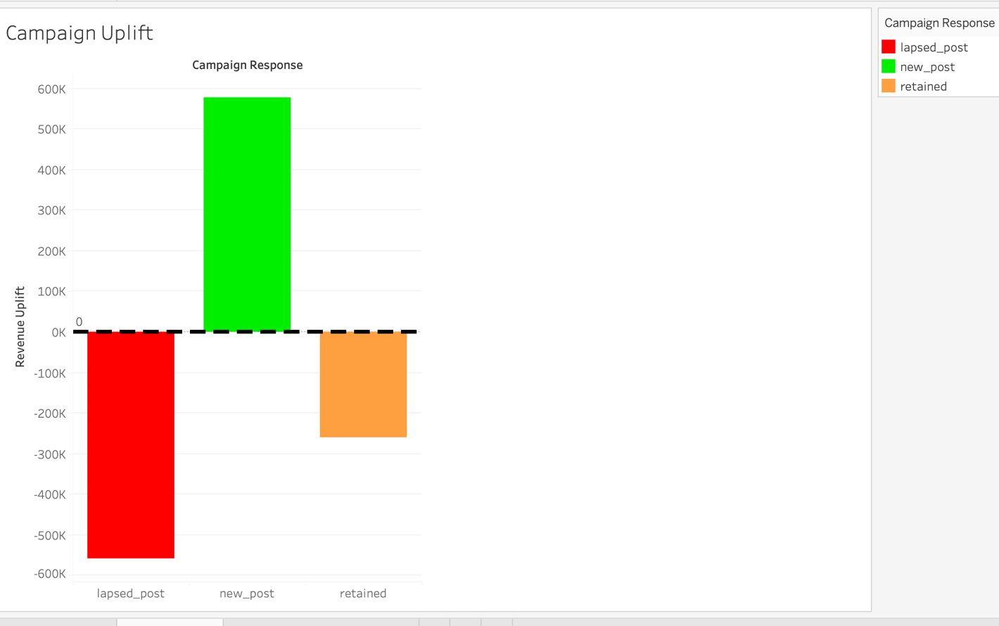

# Customer Loyalty & Cohort Analytics

An end-to-end customer analytics pipeline on the UCI Online Retail dataset (~541k transactions). Covers cohort retention analysis, RFM segmentation, logistic regression churn prediction, campaign uplift analysis, and a Tableau customer health dashboard.

---

## Architecture

```
Online Retail.xlsx (UCI dataset)
    │
    ▼
[Staging]  stg_transactions
    │       Column normalisation, type casting, revenue calculation
    ▼
[Intermediate]
    │   int_customers          — per-customer RFM inputs, cohort month, churn label
    │   int_cohort_orders      — monthly activity tagged with cohort, period number
    ▼
[Marts]
    │   fct_rfm_scores         — R/F/M quartile scores (1–4) + composite score
    │   fct_cohort_retention   — cohort × period retention matrix (% retained)
    │   fct_campaign_uplift    — pre/post holiday campaign behaviour comparison
    ▼
[Scoring]  rfm_segments
    │       Segment labels: High Value · Loyal · At-Risk · Lapsed · Promising · New
    ▼
[Python ML]  churn_model.py
    │         Logistic regression on 7 behavioural features (recency excluded to prevent leakage)
    │         Predictions written back to DuckDB: churn_predictions
    ▼
[Tableau]  Customer health dashboard
           Segment trends · Retention heatmap · Churn risk · Campaign uplift
```

---

## Key Findings

**Dataset**: 541,909 raw transactions → 397,884 clean (73.4% after removing null CustomerIDs, cancellations, and bad prices). 4,338 unique customers. Dec 2010–Dec 2011, UK-based online retailer. 91% of transactions are from the United Kingdom.

**RFM Segments**:

| Segment | Customers | Share | Description |
|---------|-----------|-------|-------------|
| High Value | 1,353 | 31.2% | Recent, frequent, high spend (R≥3, F≥3, M≥3) |
| Lapsed | 947 | 21.8% | Haven't purchased recently (R=1) |
| New | 655 | 15.1% | 1–2 purchases only |
| Promising | 568 | 13.1% | Recent but low frequency |
| At-Risk | 568 | 13.1% | Previously frequent, recency dropping |
| Loyal | 247 | 5.7% | Frequent buyers not yet at high-value threshold |

**Churn**: 33.4% of customers have churned (no purchase in the 90 days before 2011-12-09). Logistic regression model achieves **ROC-AUC 0.93, 87% accuracy**. Strongest predictor: purchase frequency (f_score coefficient –2.07) — frequent buyers are far less likely to churn. `customer_age_days` has a positive coefficient (+1.97), reflecting that older cohorts have had more time to lapse naturally.

**Cohort retention**: Month-1 retention ranges from 11–37% across cohorts. The Dec 2010 cohort (885 customers, the largest) retains 36.6% in month 1 — well above average, likely holiday-season shoppers who returned. Retention stabilises at a loyal core of ~5–10% by month 6.

**Campaign uplift** (holiday window Nov–Dec 2011 vs. Sep–Oct 2011): 850 net-new customers acquired post-campaign with average revenue uplift of +£681. Of the 1,058 customers active in both windows, average revenue actually declined by –£247, suggesting the campaign pulled forward spend rather than generating incremental revenue from existing customers.

---

## Tech Stack

| Tool | Role | Why |
|------|------|-----|
| **DuckDB** | Analytics database | In-process, no server, handles 500k rows trivially. File-based for portability. |
| **SQL (medallion layers)** | Transformation | Same staging → intermediate → marts → scoring pattern as the fraud project — each layer independently queryable. |
| **pandas** | Data loading | Reading the `.xlsx` source; DuckDB takes over once data is in-memory. |
| **scikit-learn** | Churn model | Logistic regression: interpretable coefficients, directly answers "which features drive churn?" |
| **Tableau Desktop** | Dashboard | Retention heatmap, segment KPI tiles, churn risk scatter, campaign uplift bars. |

---

## Setup

**Prerequisites**: Python 3.9+, `uv`. Download the dataset first:

1. Go to https://archive.ics.uci.edu/dataset/352/online+retail
2. Download `Online Retail.xlsx`
3. Place it in `data/raw/Online Retail.xlsx`

```bash
# Install dependencies
uv sync

# Load raw data into DuckDB
uv run python/load_data.py

# Build all SQL layers
uv run python/run_sql.py

# Train churn model and write predictions to DuckDB
uv run python/models/churn_model.py
```

---

## Dashboard

Built in Tableau Desktop, connecting to `data/duckdb/retail.duckdb` via JDBC.

### Segment Distribution
31% of customers are High Value, 22% have Lapsed — the two largest segments drive the most actionable interventions.



### Cohort Retention Heatmap
Rows = acquisition month, columns = months since first purchase, colour = retention %. Dec 2010 cohort retains 36.6% in month 1 — well above the 11–22% range for 2011 cohorts, reflecting the stronger holiday-season buyer base.



### Churn Risk Scatter
Each dot = one customer. X = total spend, Y = churn probability, size = purchase frequency. The top-left cluster (low spend, high churn probability) are new/lapsed customers. High-value customers at risk sit top-right — the priority retention targets.



### Campaign Uplift
Holiday campaign (Nov–Dec 2011 vs Sep–Oct 2011): +£578K total revenue from 850 new customers acquired, but retained customers spent –£242K less post-campaign, confirming spend was pulled forward rather than grown.



---

## What I'd Do Next

- **Survival analysis**: Kaplan-Meier curves per segment would give a more rigorous lifetime estimate than the 90-day binary churn label.
- **Random forest comparison**: benchmark against logistic regression on AUC and feature importance consistency.
- **CLV model**: combine churn probability with average order value to produce a customer lifetime value score for each segment.
- **Proper campaign groups**: the current uplift analysis uses a date-based proxy for campaign exposure; a real A/B test flag in the data would allow true causal uplift measurement.
